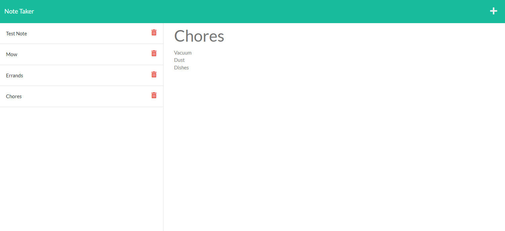

# Note Taking APP

## Description
This app can be used to create a list of notes. The server is hosted through Heroku and can save your changes in real time. Notes can be added and deleted. 

## Installation
Requirements
- express
- path
- uuid
- fs

## Usage
Run through a heroku server using the link below.

## Links
-[Github](https://github.com/heintze11/note-taker)

-[Heroku Deployment](https://gentle-woodland-92504.herokuapp.com/)

## Screenshot
